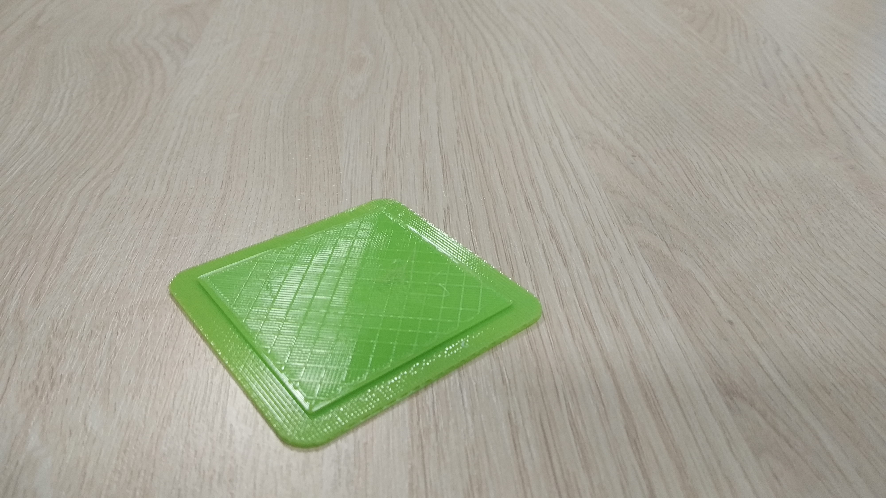
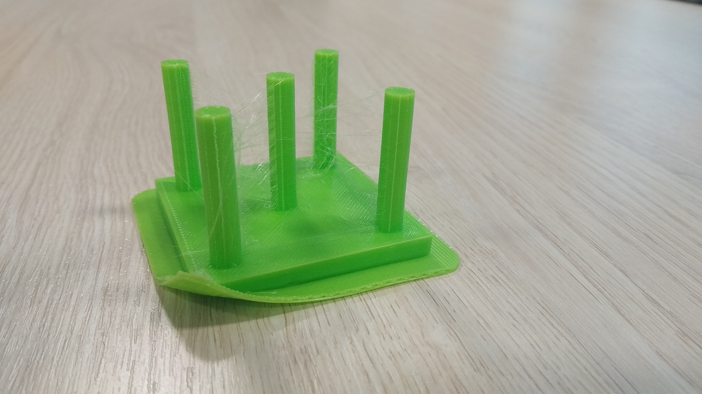
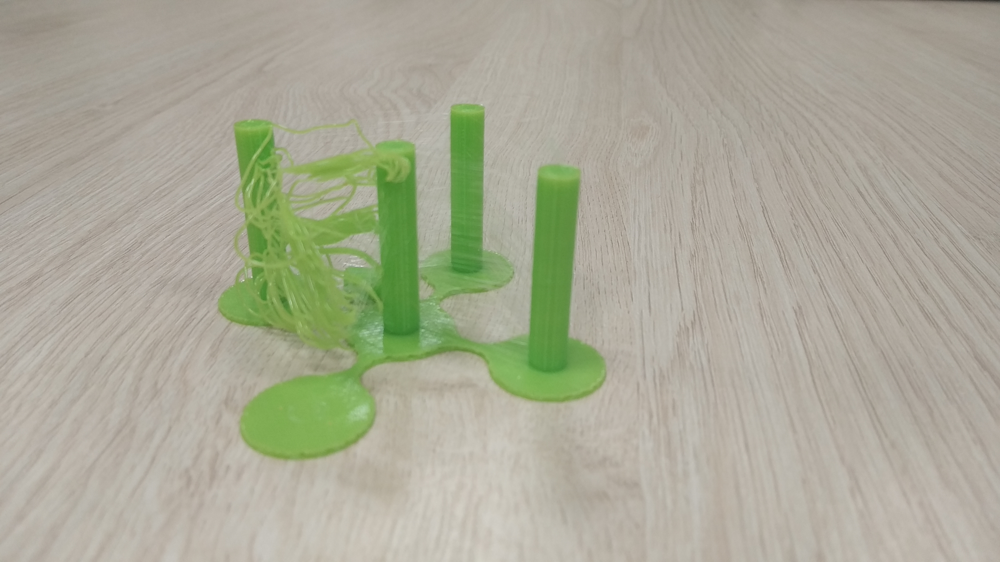
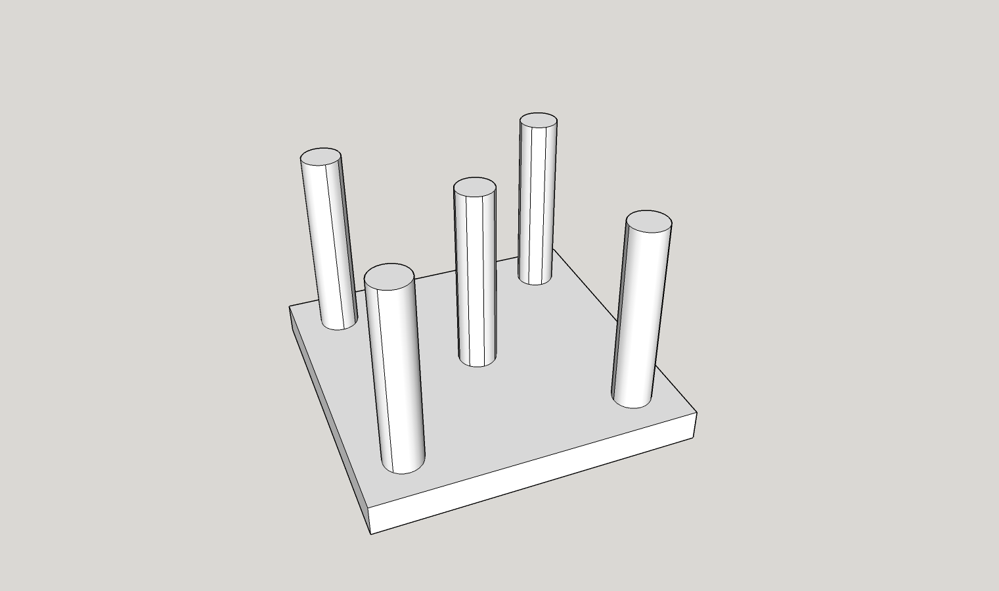
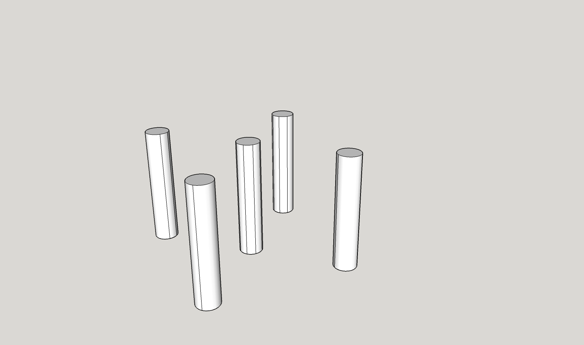

# 3D-Printing-Data

This repository contains data gathered from 3D printing machine MonkeyFab Spire. Each directory contains data samples gathered from different prints, some of them being fault. 

## Data usage 

You are free to use this data under *Creative Commons Attribution 4.0 International* license. If you use our data, please [cite us as](https://link.springer.com/chapter/10.1007/978-3-030-77970-2_50#citeas):

<cite>Szydlo T., Sendorek J., Windak M., Brzoza-Woch R. (2021) Dataset for Anomalies Detection in 3D Printing. In: Paszynski M., Kranzlmüller D., Krzhizhanovskaya V.V., Dongarra J.J., Sloot P.M. (eds) Computational Science – ICCS 2021. ICCS 2021. Lecture Notes in Computer Science, vol 12745. Springer, Cham. https://doi.org/10.1007/978-3-030-77970-2_50 </cite>

## Measurement devices characteristics

The printer has been equipped with additional custom sensors developed as part of the FogDevices4 research project. Data from them was collected using a device assembled using
modular hardware components. The printer has been equipped with two inertial measurement unit (IMU) sensors LSM9DS1 that can measure
acceleration, angular rate and magnetic field in 3 axis but
only linear acceleration was used in this case. First of the
sensors, called accel0 is attached to the printing platform and
accel1 is on the print head. Both of the sensors use the I2C
digital interface and are connected to the FogDevices hardware
platform.


## Data format

Repository contains two types of data files:

* Data that is provided by the web interface is in json file, in which each line contain different data sample object.
* Custom measurements are stored in files with csv format without header line and with a standard comma separator. 

### Data format of web interface

The data is saved in _json_ files and each line contains separate sample. Example sample look like this:

```json
{"status": "I", "coords": {"axesHomed": [1, 1, 1], "extr": [0.0], "xyz": [0.0, 0.0, 173.0]}, "currentTool": -1, "params": {"atxPower": 0, "fanPercent": [0.0, 0.0, 0.0, 0.0, 0.0, 0.0, 0.0, 0.0, 0.0], "speedFactor": 100.0, "extrFactors": [100.0], "babystep": 0.0}, "seq": 2, "sensors": {"probeValue": 0, "fanRPM": 0}, "temps": {"bed": {"current": 24.9, "active": 0.0, "state": 0, "heater": 0}, "current": [24.9, 25.1, 2000.0, 2000.0, 2000.0, 2000.0, 2000.0, 2000.0], "state": [0, 0, 0, 0, 0, 0, 0, 0], "heads": {"current": [25.1], "active": [210.0], "standby": [0.0], "state": [0]}, "tools": {"active": [[210.0]], "standby": [[0.0]]}, "extra": [{"name": "MCU", "temp": 39.0}]}, "time": 408.9, "timestamp": 1571996868631}
```

Because the data is nested json, the sugested way to read it into python is:

```python
import pandas as pd
from pandas.io.json import json_normalize
df = pd.read_json('interface.json', lines=True)
df = json_normalize(df.to_dict('records'))
```

### Data format of custom measurements

The data of custom measurements is saved in _csv_ files with no headers and standard comma delimeter. There are following columns:

* **0** - contains data id assigned as the relative time set up on the device
* **1-3** - 3-dimensional data from the first accelerometer (X, Y, Z axis respectively)
* **4-6** - 3-dimensional data from the second accelerometer (X, Y, Z axis respectively)
* **7** - tension measurements
* **8** - timestamp

In order to provide better understanding of the data, the following python script can be used to read data:
```python
import pandas as pd
df = pd.read_csv('accel.txt', names=['data_id', 'accel0X', 'accel0Y', 'accel0Z', 'accel1X', 'accel1Y',
                                'accel1Z', 'tension', 'timestamp'])
df['time'] = pd.to_datetime(df['timestamp'], unit='ms')
```

## Data files

Reference properly made print:


The files contain data from the following faulty situations:

1. Finish of 3D printing plastic.



2. Bowden tube fallout.

3. Wrong retraction setup.


4. Arm failure.

5. Unsticking of the printed model.



6. Removing part of the print during the printing phase. 



## Repository organization

The directory structure is as follows:

 * _\four_towers_ - data related to printing towers model
 
 
 
 * _\four_tower_no_base_ - data related to printing towers model, but without the base
 

 
Each directory contains **.stl** file with the print source.
Data files are organised in the following subdirectories:

1. _proper_ - reference print
2. _plastic_lack_ 
3. _unstick_
4. _bowden_

And each of them contain two files: **.csv** one with data from custom-made measuremenet devices and **.json** file with data coming from the printer interface.

## Acknowledgments
**
Data presented in this repository was gathered, preprocessed and published as part of the project **LIDER/15/0144/L-7/15/NCBR/2016**. 
